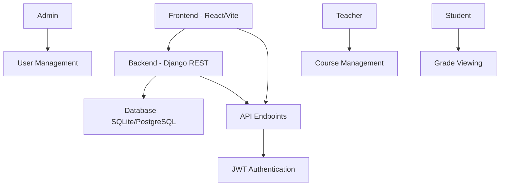

# Документация проекта "Платформа для учителей"

## Введение

### 1.1. Общее описание проекта

Проект "Платформа для учителей" представляет собой комплексную веб-систему, предназначенную для управления образовательным процессом в учебных заведениях. Система обеспечивает автоматизацию ключевых процессов, связанных с управлением студентами, преподавателями, учебными группами, курсами, предметами и оценками.

### 1.2. Цели и задачи проекта

Основные цели проекта:
- Автоматизация административных процессов в образовательных учреждениях
- Обеспечение эффективного управления учебным процессом
- Предоставление инструментов для мониторинга успеваемости студентов
- Создание единой платформы для взаимодействия между администраторами, преподавателями и студентами

### 1.3. Архитектура системы

Система построена по принципу клиент-серверной архитектуры с разделением на frontend и backend компоненты.

#### 1.3.1. Backend
- **Технология**: Django REST Framework
- **База данных**: SQLite3 (для разработки), PostgreSQL (для production)
- **Аутентификация**: JWT (JSON Web Tokens)
- **API**: RESTful API

#### 1.3.2. Frontend
- **Технология**: React.js с использованием Vite
- **Стилизация**: Bootstrap 5
- **Управление состоянием**: Zustand
- **HTTP-клиент**: Axios

### 1.4. Роли пользователей

Система поддерживает три основные роли пользователей:
- **Администратор**: Полный доступ к системе, управление пользователями, группами, курсами
- **Преподаватель**: Управление своими курсами, предметами, оценками студентов
- **Студент**: Просмотр своих оценок, информации о курсах

## Архитектура системы

### 2.1. Общая архитектура



### 2.2. Компоненты системы

#### 2.2.1. Backend компоненты
- **Config**: Основные настройки Django проекта
- **Accounts**: Управление пользователями и аутентификацией
- **Groups**: Управление учебными группами
- **Students**: Профили студентов
- **Courses**: Учебные курсы
- **Subjects**: Предметы/дисциплины
- **Grades**: Система оценок

#### 2.2.2. Frontend компоненты
- **App.jsx**: Основной компонент приложения с маршрутизацией
- **Navbar**: Навигационная панель
- **PrivateRoute**: Защита маршрутов по ролям
- **Страницы**: AdminDashboard, TeacherDashboard, StudentDashboard, Login, Register, Attestation, Exam
- **Store**: Управление состоянием аутентификации
- **Services**: API клиент

## Backend

### 3.1. Настройки проекта (config/settings.py)

Основные настройки Django проекта включают:

```python
# Основные настройки
SECRET_KEY = 'django-insecure-ng4j=hk-(2z+e)wez%22wqn%0+dw)cf&!+@smqa8^2t2u1uqzs'
DEBUG = True
ALLOWED_HOSTS = ['*']

# Установленные приложения
INSTALLED_APPS = [
    'django.contrib.admin',
    'django.contrib.auth',
    'django.contrib.contenttypes',
    'django.contrib.sessions',
    'django.contrib.messages',
    'django.contrib.staticfiles',
    
    # Third party
    'rest_framework',
    'rest_framework_simplejwt',
    'corsheaders',
    
    # Local apps
    'accounts',
    'groups',
    'students',
    'courses',
    'grades',
    'subjects',
]

# Middleware
MIDDLEWARE = [
    'django.middleware.security.SecurityMiddleware',
    'django.contrib.sessions.middleware.SessionMiddleware',
    'corsheaders.middleware.CorsMiddleware',
    'django.middleware.common.CommonMiddleware',
    'django.middleware.csrf.CsrfViewMiddleware',
    'django.contrib.auth.middleware.AuthenticationMiddleware',
    'django.contrib.messages.middleware.MessageMiddleware',
    'django.middleware.clickjacking.XFrameOptionsMiddleware',
]

# База данных
DATABASES = {
    'default': {
        'ENGINE': 'django.db.backends.sqlite3',
        'NAME': BASE_DIR / 'db.sqlite3',
    }
}

# Кастомная модель пользователя
AUTH_USER_MODEL = 'accounts.User'

# REST Framework настройки
REST_FRAMEWORK = {
    'DEFAULT_AUTHENTICATION_CLASSES': (
        'rest_framework_simplejwt.authentication.JWTAuthentication',
    ),
    'DEFAULT_PERMISSION_CLASSES': (
        'rest_framework.permissions.IsAuthenticated',
    ),
}
```

### 3.2. Модель данных

#### 3.2.1. Модель User (accounts/models.py)

```python
from django.contrib.auth.models import AbstractUser, BaseUserManager
from django.db import models

class UserManager(BaseUserManager):
    """Менеджер для кастомной модели User"""
    
    def create_user(self, email, password=None, **extra_fields):
        if not email:
            raise ValueError('Email обязателен')
        email = self.normalize_email(email)
        user = self.model(email=email, **extra_fields)
        user.set_password(password)
        user.save(using=self._db)
        return user
    
    def create_superuser(self, email, password=None, **extra_fields):
        extra_fields.setdefault('is_staff', True)
        extra_fields.setdefault('is_superuser', True)
        extra_fields.setdefault('is_active', True)
        extra_fields.setdefault('role', 'admin')
        
        if extra_fields.get('is_staff') is not True:
            raise ValueError('Superuser must have is_staff=True.')
        if extra_fields.get('is_superuser') is not True:
            raise ValueError('Superuser must have is_superuser=True.')
        
        return self.create_user(email, password, **extra_fields)

class User(AbstractUser):
    """Расширенная модель пользователя с ролями"""
    
    ROLE_CHOICES = (
        ('admin', 'Администратор'),
        ('teacher', 'Преподаватель'),
        ('student', 'Студент'),
    )
    
    email = models.EmailField(unique=True)
    full_name = models.CharField(max_length=255, blank=True)
    role = models.CharField(max_length=20, choices=ROLE_CHOICES, default='student')
    is_active = models.BooleanField(default=True)
    
    # Используем email вместо username
    username = None
    USERNAME_FIELD = 'email'
    REQUIRED_FIELDS = []
    
    objects = UserManager()
```

Модель User расширяет AbstractUser Django, используя email как основное поле для аутентификации. Поддерживает три роли: admin, teacher, student.

#### 3.2.2. Модель Group (groups/models.py)

```python
from django.db import models

class Group(models.Model):
    """Группа студентов"""
    
    name = models.CharField(max_length=50, verbose_name="Название группы")
    year = models.IntegerField(verbose_name="Курс", default=1)
    created_at = models.DateTimeField(auto_now_add=True)
    
    def __str__(self):
        return f"{self.name}"
    
    class Meta:
        verbose_name = 'Группа'
        verbose_name_plural = 'Группы'
        ordering = ['name']
```

Модель Group представляет учебную группу с названием и годом обучения.

#### 3.2.3. Модель Student (students/models.py)

```python
from django.db import models
from django.conf import settings

class Student(models.Model):
    """Профиль студента"""
    
    user = models.OneToOneField(
        settings.AUTH_USER_MODEL,
        on_delete=models.CASCADE,
        related_name='student_profile',
        verbose_name="Пользователь"
    )
    student_id_number = models.CharField(max_length=20, verbose_name="Номер билета")
    group = models.ForeignKey(
        'groups.Group',
        on_delete=models.SET_NULL,
        null=True,
        related_name='students',
        verbose_name="Группа"
    )
    created_at = models.DateTimeField(auto_now_add=True)
    
    def __str__(self):
        return f"{self.user.full_name or self.user.email} ({self.student_id_number})"
    
    class Meta:
        verbose_name = 'Студент'
        verbose_name_plural = 'Студенты'
        ordering = ['user__full_name']
```

Модель Student связывает пользователя с профилем студента, включая номер студенческого билета и группу.

#### 3.2.4. Модель Subject (subjects/models.py)

```python
from django.db import models
from django.conf import settings

class Subject(models.Model):
    """Предмет/Дисциплина"""

    name = models.CharField(max_length=200, verbose_name="Название предмета")
    teacher = models.ForeignKey(
        settings.AUTH_USER_MODEL,
        on_delete=models.SET_NULL,
        null=True,
        limit_choices_to={'role': 'teacher'},
        related_name='subjects',
        verbose_name="Преподаватель"
    )
    group = models.ForeignKey(
        'groups.Group',
        on_delete=models.CASCADE,
        related_name='subjects',
        verbose_name="Группа"
    )
    created_at = models.DateTimeField(auto_now_add=True)

    def __str__(self):
        return f"{self.name} - {self.teacher.full_name if self.teacher else 'Б/П'} ({self.group.name})"

    class Meta:
        verbose_name = 'Предмет'
        verbose_name_plural = 'Предметы'
        ordering = ['name']
```

Модель Subject представляет учебный предмет, связанный с преподавателем и группой.

#### 3.2.5. Модель Course (courses/models.py)

```python
from django.db import models
from django.conf import settings

class Course(models.Model):
    """Учебный курс/предмет"""
    
    name = models.CharField(max_length=200, verbose_name="Название курса")
    teacher = models.ForeignKey(
        settings.AUTH_USER_MODEL,
        on_delete=models.SET_NULL,
        null=True,
        limit_choices_to={'role': 'teacher'},
        related_name='courses',
        verbose_name="Преподаватель"
    )
    group = models.ForeignKey(
        'groups.Group',
        on_delete=models.CASCADE,
        related_name='courses',
        verbose_name="Группа"
    )
    created_at = models.DateTimeField(auto_now_add=True)
    
    def __str__(self):
        return f"{self.name} - {self.teacher.full_name if self.teacher else 'Б/П'} ({self.group.name})"
    
    class Meta:
        verbose_name = 'Курс'
        verbose_name_plural = 'Курсы'
        ordering = ['name']
```

Модель Course аналогична Subject, представляет учебный курс.

#### 3.2.6. Модель Grade (grades/models.py)

```python
from django.db import models
from django.utils import timezone

class Grade(models.Model):
    """Оценка студента"""

    student = models.ForeignKey(
        'students.Student',
        on_delete=models.CASCADE,
        related_name='grades',
        verbose_name="Студент"
    )
    subject = models.ForeignKey(
        'subjects.Subject',
        on_delete=models.CASCADE,
        related_name='grades',
        verbose_name="Предмет"
    )
    value = models.IntegerField(verbose_name="Оценка", default=5)
    comment = models.TextField(blank=True, null=True, verbose_name="Комментарий")
    date = models.DateField(default=timezone.now, verbose_name="Дата")
    created_at = models.DateTimeField(auto_now_add=True)

    def __str__(self):
        return f"{self.student.user.full_name}: {self.value} ({self.subject.name})"

    class Meta:
        verbose_name = 'Оценка'
        verbose_name_plural = 'Оценки'
        ordering = ['-date']
```

Модель Grade хранит оценки студентов по предметам с комментариями и датами.

### 3.3. API Endpoints

#### 3.3.1. Аутентификация

- `POST /api/auth/login/`: Вход в систему
- `POST /api/auth/refresh/`: Обновление JWT токена
- `POST /api/auth/register/`: Регистрация нового пользователя
- `GET /api/auth/me/`: Получение данных текущего пользователя

#### 3.3.2. Управление пользователями

- `GET /api/users/`: Список пользователей (только для администраторов)
- `GET /api/users/<id>/`: Детали пользователя
- `PUT /api/users/<id>/`: Обновление пользователя
- `DELETE /api/users/<id>/`: Удаление пользователя

#### 3.3.3. Группы

- `GET /api/groups/`: Список групп
- `POST /api/groups/`: Создание группы

#### 3.3.4. Предметы

- `GET /api/subjects/`: Список предметов
- `POST /api/subjects/`: Создание предмета

#### 3.3.5. Студенты

- `GET /api/students/`: Список студентов
- `POST /api/students/`: Создание профиля студента
- `GET /api/students/<id>/`: Детали студента
- `PUT /api/students/<id>/`: Обновление студента
- `DELETE /api/students/<id>/`: Удаление студента

#### 3.3.6. Курсы

- `GET /api/courses/`: Список курсов
- `POST /api/courses/`: Создание курса
- `GET /api/courses/<id>/`: Детали курса
- `PUT /api/courses/<id>/`: Обновление курса
- `DELETE /api/courses/<id>/`: Удаление курса

#### 3.3.7. Оценки

- `GET /api/grades/`: Список оценок
- `POST /api/grades/`: Создание оценки
- `GET /api/grades/<id>/`: Детали оценки
- `PUT /api/grades/<id>/`: Обновление оценки
- `DELETE /api/grades/<id>/`: Удаление оценки

## Frontend

### 4.1. Структура проекта

Frontend построен на React.js с использованием следующих технологий:
- **React 18**: Основная библиотека для построения пользовательского интерфейса
- **React Router DOM**: Маршрутизация
- **Vite**: Инструмент сборки и разработки
- **Axios**: HTTP клиент для API запросов
- **Zustand**: Управление состоянием
- **Bootstrap 5**: CSS фреймворк для стилизации

### 4.2. Основные компоненты

#### 4.2.1. App.jsx

Основной компонент приложения, отвечающий за маршрутизацию:

```jsx
import { BrowserRouter as Router, Routes, Route, Navigate } from 'react-router-dom'
import Navbar from './components/Navbar'
import PrivateRoute from './components/PrivateRoute'
import Login from './pages/Login'
import Register from './pages/Register'
import AdminDashboard from './pages/AdminDashboard'
import TeacherDashboard from './pages/TeacherDashboard'
import StudentDashboard from './pages/StudentDashboard'
import Attestation from './pages/Attestation'
import Exam from './pages/Exam'

function App() {
  return (
    <Router>
      <Navbar />
      <div className="container mt-4">
        <Routes>
          <Route path="/login" element={<Login />} />
          <Route path="/register" element={<Register />} />
          
          <Route
            path="/admin"
            element={
              <PrivateRoute allowedRoles={['admin']}>
                <AdminDashboard />
              </PrivateRoute>
            }
          />
          
          <Route
            path="/teacher"
            element={
              <PrivateRoute allowedRoles={['teacher']}>
                <TeacherDashboard />
              </PrivateRoute>
            }
          />
          
          <Route
            path="/attestation"
            element={
              <PrivateRoute allowedRoles={['teacher']}>
                <Attestation />
              </PrivateRoute>
            }
          />
          
          <Route
            path="/exam"
            element={
              <PrivateRoute allowedRoles={['teacher']}>
                <Exam />
              </PrivateRoute>
            }
          />
          
          <Route
            path="/student"
            element={
              <PrivateRoute allowedRoles={['student']}>
                <StudentDashboard />
              </PrivateRoute>
            }
          />
          
          <Route path="/" element={<Navigate to="/login" replace />} />
          <Route path="*" element={<Navigate to="/login" replace />} />
        </Routes>
      </div>
    </Router>
  )
}

export default App
```

#### 4.2.2. PrivateRoute.jsx

Компонент для защиты маршрутов на основе ролей пользователей:

```jsx
import { Navigate } from 'react-router-dom'
import useAuthStore from '../store/authStore'

const PrivateRoute = ({ children, allowedRoles }) => {
  const { isAuthenticated, user } = useAuthStore()
  
  if (!isAuthenticated()) {
    return <Navigate to="/login" replace />
  }
  
  if (allowedRoles && !allowedRoles.includes(user?.role)) {
    return <Navigate to="/login" replace />
  }
  
  return children
}

export default PrivateRoute
```

#### 4.2.3. Navbar.jsx

Навигационная панель с динамическим отображением меню в зависимости от роли:

```jsx
import { Link, useNavigate } from 'react-router-dom'
import useAuthStore from '../store/authStore'

const Navbar = () => {
  const { isAuthenticated, user, logout } = useAuthStore()
  const navigate = useNavigate()
  
  const handleLogout = () => {
    logout()
    navigate('/login')
  }
  
  return (
    <nav className="navbar navbar-expand-lg navbar-dark bg-dark">
      <div className="container">
        <Link className="navbar-brand" to="/">Платформа для учителей</Link>
        
        <div className="navbar-nav ms-auto">
          {isAuthenticated() ? (
            <>
              <span className="navbar-text me-3">
                Добро пожаловать, {user?.full_name || user?.email}
              </span>
              
              {user?.role === 'admin' && (
                <Link className="nav-link" to="/admin">Админ панель</Link>
              )}
              
              {user?.role === 'teacher' && (
                <>
                  <Link className="nav-link" to="/teacher">Преподаватель</Link>
                  <Link className="nav-link" to="/attestation">Аттестация</Link>
                  <Link className="nav-link" to="/exam">Экзамен</Link>
                </>
              )}
              
              {user?.role === 'student' && (
                <Link className="nav-link" to="/student">Студент</Link>
              )}
              
              <button className="btn btn-outline-light ms-3" onClick={handleLogout}>
                Выход
              </button>
            </>
          ) : (
            <>
              <Link className="nav-link" to="/login">Вход</Link>
              <Link className="nav-link" to="/register">Регистрация</Link>
            </>
          )}
        </div>
      </div>
    </nav>
  )
}

export default Navbar
```

### 4.3. Управление состоянием

#### 4.3.1. Auth Store (authStore.js)

```jsx
import { create } from 'zustand'
import api from '../services/api'

const useAuthStore = create((set) => ({
  token: localStorage.getItem('token') || null,
  user: JSON.parse(localStorage.getItem('user')) || null,

  isAuthenticated: () => !!localStorage.getItem('token'),

  login: async (email, password) => {
    const response = await api.post('/auth/login/', { email, password })
    const { access } = response.data
    
    localStorage.setItem('token', access)
    
    // Получаем данные пользователя
    const userResponse = await api.get('/auth/me/')
    const user = userResponse.data
    
    localStorage.setItem('user', JSON.stringify(user))
    set({ token: access, user })
    
    return user
  },

  register: async (userData) => {
    const response = await api.post('/auth/register/', userData)
    return response.data
  },

  logout: () => {
    localStorage.removeItem('token')
    localStorage.removeItem('user')
    set({ token: null, user: null })
  },

  updateUser: (user) => {
    localStorage.setItem('user', JSON.stringify(user))
    set({ user })
  },
}))

export default useAuthStore
```

### 4.4. API сервис

#### 4.4.1. api.js

```jsx
import axios from 'axios'

const api = axios.create({
  baseURL: '/api',
  headers: {
    'Content-Type': 'application/json',
  },
})

// Добавляем токен к запросам
api.interceptors.request.use((config) => {
  const token = localStorage.getItem('token')
  if (token) {
    config.headers.Authorization = `Bearer ${token}`
  }
  return config
})

// Обработка ошибок авторизации
api.interceptors.response.use(
  (response) => response,
  (error) => {
    if (error.response?.status === 401) {
      localStorage.removeItem('token')
      localStorage.removeItem('user')
      window.location.href = '/login'
    }
    return Promise.reject(error)
  }
)

export default api
```

### 4.5. Страницы приложения

#### 4.5.1. Login.jsx

Страница входа в систему:

```jsx
import { useState } from 'react'
import { useNavigate } from 'react-router-dom'
import useAuthStore from '../store/authStore'

const Login = () => {
  const [email, setEmail] = useState('')
  const [password, setPassword] = useState('')
  const [error, setError] = useState('')
  const { login } = useAuthStore()
  const navigate = useNavigate()
  
  const handleSubmit = async (e) => {
    e.preventDefault()
    try {
      const user = await login(email, password)
      if (user.role === 'admin') {
        navigate('/admin')
      } else if (user.role === 'teacher') {
        navigate('/teacher')
      } else {
        navigate('/student')
      }
    } catch (err) {
      setError('Неверный email или пароль')
    }
  }
  
  return (
    <div className="row justify-content-center">
      <div className="col-md-6">
        <div className="card">
          <div className="card-header">
            <h3>Вход в систему</h3>
          </div>
          <div className="card-body">
            {error && <div className="alert alert-danger">{error}</div>}
            <form onSubmit={handleSubmit}>
              <div className="mb-3">
                <label className="form-label">Email</label>
                <input
                  type="email"
                  className="form-control"
                  value={email}
                  onChange={(e) => setEmail(e.target.value)}
                  required
                />
              </div>
              <div className="mb-3">
                <label className="form-label">Пароль</label>
                <input
                  type="password"
                  className="form-control"
                  value={password}
                  onChange={(e) => setPassword(e.target.value)}
                  required
                />
              </div>
              <button type="submit" className="btn btn-primary">Войти</button>
            </form>
          </div>
        </div>
      </div>
    </div>
  )
}

export default Login
```

#### 4.5.2. Register.jsx

Страница регистрации:

```jsx
import { useState, useEffect } from 'react'
import { useNavigate } from 'react-router-dom'
import useAuthStore from '../store/authStore'
import api from '../services/api'

const Register = () => {
  const [formData, setFormData] = useState({
    email: '',
    password: '',
    password2: '',
    full_name: '',
    role: 'student',
    student_id_number: '',
    group: ''
  })
  const [groups, setGroups] = useState([])
  const [error, setError] = useState('')
  const { register } = useAuthStore()
  const navigate = useNavigate()
  
  useEffect(() => {
    const fetchGroups = async () => {
      try {
        const response = await api.get('/groups/')
        setGroups(response.data)
      } catch (err) {
        console.error('Ошибка загрузки групп:', err)
      }
    }
    fetchGroups()
  }, [])
  
  const handleChange = (e) => {
    setFormData({
      ...formData,
      [e.target.name]: e.target.value
    })
  }
  
  const handleSubmit = async (e) => {
    e.preventDefault()
    if (formData.password !== formData.password2) {
      setError('Пароли не совпадают')
      return
    }
    
    try {
      await register(formData)
      navigate('/login')
    } catch (err) {
      setError('Ошибка регистрации')
    }
  }
  
  return (
    <div className="row justify-content-center">
      <div className="col-md-8">
        <div className="card">
          <div className="card-header">
            <h3>Регистрация</h3>
          </div>
          <div className="card-body">
            {error && <div className="alert alert-danger">{error}</div>}
            <form onSubmit={handleSubmit}>
              <div className="row">
                <div className="col-md-6">
                  <div className="mb-3">
                    <label className="form-label">Email</label>
                    <input
                      type="email"
                      className="form-control"
                      name="email"
                      value={formData.email}
                      onChange={handleChange}
                      required
                    />
                  </div>
                </div>
                <div className="col-md-6">
                  <div className="mb-3">
                    <label className="form-label">Полное имя</label>
                    <input
                      type="text"
                      className="form-control"
                      name="full_name"
                      value={formData.full_name}
                      onChange={handleChange}
                      required
                    />
                  </div>
                </div>
              </div>
              
              <div className="row">
                <div className="col-md-6">
                  <div className="mb-3">
                    <label className="form-label">Пароль</label>
                    <input
                      type="password"
                      className="form-control"
                      name="password"
                      value={formData.password}
                      onChange={handleChange}
                      required
                    />
                  </div>
                </div>
                <div className="col-md-6">
                  <div className="mb-3">
                    <label className="form-label">Подтверждение пароля</label>
                    <input
                      type="password"
                      className="form-control"
                      name="password2"
                      value={formData.password2}
                      onChange={handleChange}
                      required
                    />
                  </div>
                </div>
              </div>
              
              <div className="mb-3">
                <label className="form-label">Роль</label>
                <select
                  className="form-control"
                  name="role"
                  value={formData.role}
                  onChange={handleChange}
                  required
                >
                  <option value="student">Студент</option>
                  <option value="teacher">Преподаватель</option>
                </select>
              </div>
              
              {formData.role === 'student' && (
                <>
                  <div className="mb-3">
                    <label className="form-label">Номер студенческого билета</label>
                    <input
                      type="text"
                      className="form-control"
                      name="student_id_number"
                      value={formData.student_id_number}
                      onChange={handleChange}
                      required
                    />
                  </div>
                  
                  <div className="mb-3">
                    <label className="form-label">Группа</label>
                    <select
                      className="form-control"
                      name="group"
                      value={formData.group}
                      onChange={handleChange}
                      required
                    >
                      <option value="">Выберите группу</option>
                      {groups.map(group => (
                        <option key={group.id} value={group.id}>{group.name}</option>
                      ))}
                    </select>
                  </div>
                </>
              )}
              
              <button type="submit" className="btn btn-primary">Зарегистрироваться</button>
            </form>
          </div>
        </div>
      </div>
    </div>
  )
}

export default Register
```

#### 4.5.3. AdminDashboard.jsx

Панель администратора для управления пользователями и системой:

```jsx
import { useState, useEffect } from 'react'
import api from '../services/api'

const AdminDashboard = () => {
  const [users, setUsers] = useState([])
  const [groups, setGroups] = useState([])
  const [subjects, setSubjects] = useState([])
  const [courses, setCourses] = useState([])
  const [grades, setGrades] = useState([])
  const [activeTab, setActiveTab] = useState('users')
  
  useEffect(() => {
    fetchData()
  }, [])
  
  const fetchData = async () => {
    try {
      const [usersRes, groupsRes, subjectsRes, coursesRes, gradesRes] = await Promise.all([
        api.get('/users/'),
        api.get('/groups/'),
        api.get('/subjects/'),
        api.get('/courses/'),
        api.get('/grades/')
      ])
      
      setUsers(usersRes.data)
      setGroups(groupsRes.data)
      setSubjects(subjectsRes.data)
      setCourses(coursesRes.data)
      setGrades(gradesRes.data)
    } catch (err) {
      console.error('Ошибка загрузки данных:', err)
    }
  }
  
  const renderUsersTab = () => (
    <div>
      <h4>Пользователи системы</h4>
      <div className="table-responsive">
        <table className="table table-striped">
          <thead>
            <tr>
              <th>ID</th>
              <th>Email</th>
              <th>Полное имя</th>
              <th>Роль</th>
              <th>Активен</th>
              <th>Дата создания</th>
            </tr>
          </thead>
          <tbody>
            {users.map(user => (
              <tr key={user.id}>
                <td>{user.id}</td>
                <td>{user.email}</td>
                <td>{user.full_name}</td>
                <td>
                  <span className={`badge bg-${user.role === 'admin' ? 'danger' : user.role === 'teacher' ? 'warning' : 'info'}`}>
                    {user.role === 'admin' ? 'Администратор' : user.role === 'teacher' ? 'Преподаватель' : 'Студент'}
                  </span>
                </td>
                <td>
                  <span className={`badge bg-${user.is_active ? 'success' : 'secondary'}`}>
                    {user.is_active ? 'Да' : 'Нет'}
                  </span>
                </td>
                <td>{new Date(user.date_joined).toLocaleDateString()}</td>
              </tr>
            ))}
          </tbody>
        </table>
      </div>
    </div>
  )
  
  const renderGroupsTab = () => (
    <div>
      <h4>Учебные группы</h4>
      <div className="table-responsive">
        <table className="table table-striped">
          <thead>
            <tr>
              <th>ID</th>
              <th>Название</th>
              <th>Курс</th>
              <th>Количество студентов</th>
              <th>Дата создания</th>
            </tr>
          </thead>
          <tbody>
            {groups.map(group => (
              <tr key={group.id}>
                <td>{group.id}</td>
                <td>{group.name}</td>
                <td>{group.year}</td>
                <td>{group.students_count || 0}</td>
                <td>{new Date(group.created_at).toLocaleDateString()}</td>
              </tr>
            ))}
          </tbody>
        </table>
      </div>
    </div>
  )
  
  const renderSubjectsTab = () => (
    <div>
      <h4>Предметы</h4>
      <div className="table-responsive">
        <table className="table table-striped">
          <thead>
            <tr>
              <th>ID</th>
              <th>Название</th>
              <th>Преподаватель</th>
              <th>Группа</th>
              <th>Дата создания</th>
            </tr>
          </thead>
          <tbody>
            {subjects.map(subject => (
              <tr key={subject.id}>
                <td>{subject.id}</td>
                <td>{subject.name}</td>
                <td>{subject.teacher?.full_name || 'Не назначен'}</td>
                <td>{subject.group?.name || 'Не указана'}</td>
                <td>{new Date(subject.created_at).toLocaleDateString()}</td>
              </tr>
            ))}
          </tbody>
        </table>
      </div>
    </div>
  )
  
  const renderCoursesTab = () => (
    <div>
      <h4>Курсы</h4>
      <div className="table-responsive">
        <table className="table table-striped">
          <thead>
            <tr>
              <th>ID</th>
              <th>Название</th>
              <th>Преподаватель</th>
              <th>Группа</th>
              <th>Дата создания</th>
            </tr>
          </thead>
          <tbody>
            {courses.map(course => (
              <tr key={course.id}>
                <td>{course.id}</td>
                <td>{course.name}</td>
                <td>{course.teacher?.full_name || 'Не назначен'}</td>
                <td>{course.group?.name || 'Не указана'}</td>
                <td>{new Date(course.created_at).toLocaleDateString()}</td>
              </tr>
            ))}
          </tbody>
        </table>
      </div>
    </div>
  )
  
  const renderGradesTab = () => (
    <div>
      <h4>Оценки</h4>
      <div className="table-responsive">
        <table className="table table-striped">
          <thead>
            <tr>
              <th>ID</th>
              <th>Студент</th>
              <th>Предмет</th>
              <th>Оценка</th>
              <th>Комментарий</th>
              <th>Дата</th>
            </tr>
          </thead>
          <tbody>
            {grades.map(grade => (
              <tr key={grade.id}>
                <td>{grade.id}</td>
                <td>{grade.student?.user?.full_name || grade.student?.user?.email}</td>
                <td>{grade.subject?.name}</td>
                <td>
                  <span className={`badge bg-${grade.value >= 4 ? 'success' : grade.value >= 3 ? 'warning' : 'danger'}`}>
                    {grade.value}
                  </span>
                </td>
                <td>{grade.comment || '-'}</td>
                <td>{new Date(grade.date).toLocaleDateString()}</td>
              </tr>
            ))}
          </tbody>
        </table>
      </div>
    </div>
  )
  
  return (
    <div>
      <h2>Панель администратора</h2>
      
      <ul className="nav nav-tabs">
        <li className="nav-item">
          <button 
            className={`nav-link ${activeTab === 'users' ? 'active' : ''}`}
            onClick={() => setActiveTab('users')}
          >
            Пользователи
          </button>
        </li>
        <li className="nav-item">
          <button 
            className={`nav-link ${activeTab === 'groups' ? 'active' : ''}`}
            onClick={() => setActiveTab('groups')}
          >
            Группы
          </button>
        </li>
        <li className="nav-item">
          <button 
            className={`nav-link ${activeTab === 'subjects' ? 'active' : ''}`}
            onClick={() => setActiveTab('subjects')}
          >
            Предметы
          </button>
        </li>
        <li className="nav-item">
          <button 
            className={`nav-link ${activeTab === 'courses' ? 'active' : ''}`}
            onClick={() => setActiveTab('courses')}
          >
            Курсы
          </button>
        </li>
        <li className="nav-item">
          <button 
            className={`nav-link ${activeTab === 'grades' ? 'active' : ''}`}
            onClick={() => setActiveTab('grades')}
          >
            Оценки
          </button>
        </li>
      </ul>
      
      <div className="tab-content mt-4">
        {activeTab === 'users' && renderUsersTab()}
        {activeTab === 'groups' && renderGroupsTab()}
        {activeTab === 'subjects' && renderSubjectsTab()}
        {activeTab === 'courses' && renderCoursesTab()}
        {activeTab === 'grades' && renderGradesTab()}
      </div>
    </div>
  )
}

export default AdminDashboard
```

#### 4.5.4. TeacherDashboard.jsx

Панель преподавателя для управления курсами и оценками:

```jsx
import { useState, useEffect } from 'react'
import api from '../services/api'
import useAuthStore from '../store/authStore'

const TeacherDashboard = () => {
  const [courses, setCourses] = useState([])
  const [subjects, setSubjects] = useState([])
  const [grades, setGrades] = useState([])
  const [students, setStudents] = useState([])
  const [activeTab, setActiveTab] = useState('courses')
  const [selectedSubject, setSelectedSubject] = useState('')
  const [newGrade, setNewGrade] = useState({
    student: '',
    subject: '',
    value: 5,
    comment: '',
    date: new Date().toISOString().split('T')[0]
  })
  const { user } = useAuthStore()
  
  useEffect(() => {
    fetchData()
  }, [])
  
  const fetchData = async () => {
    try {
      const [coursesRes, subjectsRes, gradesRes, studentsRes] = await Promise.all([
        api.get('/courses/'),
        api.get('/subjects/'),
        api.get('/grades/'),
        api.get('/students/')
      ])
      
      // Фильтруем курсы и предметы преподавателя
      setCourses(coursesRes.data.filter(course => course.teacher === user.id))
      setSubjects(subjectsRes.data.filter(subject => subject.teacher === user.id))
      setGrades(gradesRes.data.filter(grade => 
        subjectsRes.data.some(subject => subject.id === grade.subject && subject.teacher === user.id)
      ))
      setStudents(studentsRes.data)
    } catch (err) {
      console.error('Ошибка загрузки данных:', err)
    }
  }
  
  const handleAddGrade = async (e) => {
    e.preventDefault()
    try {
      await api.post('/grades/', newGrade)
      setNewGrade({
        student: '',
        subject: '',
        value: 5,
        comment: '',
        date: new Date().toISOString().split('T')[0]
      })
      fetchData()
    } catch (err) {
      console.error('Ошибка добавления оценки:', err)
    }
  }
  
  const renderCoursesTab = () => (
    <div>
      <h4>Мои курсы</h4>
      <div className="row">
        {courses.map(course => (
          <div key={course.id} className="col-md-4 mb-3">
            <div className="card">
              <div className="card-body">
                <h5 className="card-title">{course.name}</h5>
                <p className="card-text">Группа: {course.group?.name}</p>
                <p className="card-text">Дата создания: {new Date(course.created_at).toLocaleDateString()}</p>
              </div>
            </div>
          </div>
        ))}
      </div>
    </div>
  )
  
  const renderSubjectsTab = () => (
    <div>
      <h4>Мои предметы</h4>
      <div className="row">
        {subjects.map(subject => (
          <div key={subject.id} className="col-md-4 mb-3">
            <div className="card">
              <div className="card-body">
                <h5 className="card-title">{subject.name}</h5>
                <p className="card-text">Группа: {subject.group?.name}</p>
                <p className="card-text">Дата создания: {new Date(subject.created_at).toLocaleDateString()}</p>
              </div>
            </div>
          </div>
        ))}
      </div>
    </div>
  )
  
  const renderGradesTab = () => (
    <div>
      <h4>Управление оценками</h4>
      
      <div className="row">
        <div className="col-md-8">
          <h5>Существующие оценки</h5>
          <div className="table-responsive">
            <table className="table table-striped">
              <thead>
                <tr>
                  <th>Студент</th>
                  <th>Предмет</th>
                  <th>Оценка</th>
                  <th>Комментарий</th>
                  <th>Дата</th>
                </tr>
              </thead>
              <tbody>
                {grades.map(grade => (
                  <tr key={grade.id}>
                    <td>{grade.student?.user?.full_name || grade.student?.user?.email}</td>
                    <td>{grade.subject?.name}</td>
                    <td>
                      <span className={`badge bg-${grade.value >= 4 ? 'success' : grade.value >= 3 ? 'warning' : 'danger'}`}>
                        {grade.value}
                      </span>
                    </td>
                    <td>{grade.comment || '-'}</td>
                    <td>{new Date(grade.date).toLocaleDateString()}</td>
                  </tr>
                ))}
              </tbody>
            </table>
          </div>
        </div>
        
        <div className="col-md-4">
          <h5>Добавить оценку</h5>
          <form onSubmit={handleAddGrade}>
            <div className="mb-3">
              <label className="form-label">Предмет</label>
              <select
                className="form-control"
                value={newGrade.subject}
                onChange={(e) => setNewGrade({...newGrade, subject: e.target.value})}
                required
              >
                <option value="">Выберите предмет</option>
                {subjects.map(subject => (
                  <option key={subject.id} value={subject.id}>{subject.name}</option>
                ))}
              </select>
            </div>
            
            <div className="mb-3">
              <label className="form-label">Студент</label>
              <select
                className="form-control"
                value={newGrade.student}
                onChange={(e) => setNewGrade({...newGrade, student: e.target.value})}
                required
              >
                <option value="">Выберите студента</option>
                {students.filter(student => 
                  subjects.find(subject => subject.id == newGrade.subject)?.group?.id === student.group
                ).map(student => (
                  <option key={student.id} value={student.id}>
                    {student.user.full_name || student.user.email} ({student.student_id_number})
                  </option>
                ))}
              </select>
            </div>
            
            <div className="mb-3">
              <label className="form-label">Оценка</label>
              <select
                className="form-control"
                value={newGrade.value}
                onChange={(e) => setNewGrade({...newGrade, value: parseInt(e.target.value)})}
                required
              >
                <option value={2}>2</option>
                <option value={3}>3</option>
                <option value={4}>4</option>
                <option value={5}>5</option>
              </select>
            </div>
            
            <div className="mb-3">
              <label className="form-label">Комментарий</label>
              <textarea
                className="form-control"
                value={newGrade.comment}
                onChange={(e) => setNewGrade({...newGrade, comment: e.target.value})}
                rows="3"
              />
            </div>
            
            <div className="mb-3">
              <label className="form-label">Дата</label>
              <input
                type="date"
                className="form-control"
                value={newGrade.date}
                onChange={(e) => setNewGrade({...newGrade, date: e.target.value})}
                required
              />
            </div>
            
            <button type="submit" className="btn btn-primary">Добавить оценку</button>
          </form>
        </div>
      </div>
    </div>
  )
  
  return (
    <div>
      <h2>Панель преподавателя</h2>
      
      <ul className="nav nav-tabs">
        <li className="nav-item">
          <button 
            className={`nav-link ${activeTab === 'courses' ? 'active' : ''}`}
            onClick={() => setActiveTab('courses')}
          >
            Мои курсы
          </button>
        </li>
        <li className="nav-item">
          <button 
            className={`nav-link ${activeTab === 'subjects' ? 'active' : ''}`}
            onClick={() => setActiveTab('subjects')}
          >
            Мои предметы
          </button>
        </li>
        <li className="nav-item">
          <button 
            className={`nav-link ${activeTab === 'grades' ? 'active' : ''}`}
            onClick={() => setActiveTab('grades')}
          >
            Оценки
          </button>
        </li>
      </ul>
      
      <div className="tab-content mt-4">
        {activeTab === 'courses' && renderCoursesTab()}
        {activeTab === 'subjects' && renderSubjectsTab()}
        {activeTab === 'grades' && renderGradesTab()}
      </div>
    </div>
  )
}

export default TeacherDashboard
```

#### 4.5.5. StudentDashboard.jsx

Панель студента для просмотра оценок:

```jsx
import { useState, useEffect } from 'react'
import api from '../services/api'
import useAuthStore from '../store/authStore'

const StudentDashboard = () => {
  const [grades, setGrades] = useState([])
  const [subjects, setSubjects] = useState([])
  const [studentProfile, setStudentProfile] = useState(null)
  const { user } = useAuthStore()
  
  useEffect(() => {
    fetchData()
  }, [])
  
  const fetchData = async () => {
    try {
      const [gradesRes, subjectsRes, studentRes] = await Promise.all([
        api.get('/grades/'),
        api.get('/subjects/'),
        api.get('/students/')
      ])
      
      // Находим профиль студента
      const profile = studentRes.data.find(student => student.user.id === user.id)
      setStudentProfile(profile)
      
      // Фильтруем оценки студента
      if (profile) {
        setGrades(gradesRes.data.filter(grade => grade.student === profile.id))
        setSubjects(subjectsRes.data.filter(subject => subject.group === profile.group))
      }
    } catch (err) {
      console.error('Ошибка загрузки данных:', err)
    }
  }
  
  const calculateAverageGrade = () => {
    if (grades.length === 0) return 0
    const sum = grades.reduce((acc, grade) => acc + grade.value, 0)
    return (sum / grades.length).toFixed(2)
  }
  
  const getGradeStats = () => {
    const stats = { 2: 0, 3: 0, 4: 0, 5: 0 }
    grades.forEach(grade => {
      stats[grade.value] = (stats[grade.value] || 0) + 1
    })
    return stats
  }
  
  const stats = getGradeStats()
  
  return (
    <div>
      <h2>Личный кабинет студента</h2>
      
      {studentProfile && (
        <div className="row mb-4">
          <div className="col-md-6">
            <div className="card">
              <div className="card-header">
                <h5>Личная информация</h5>
              </div>
              <div className="card-body">
                <p><strong>Полное имя:</strong> {user.full_name}</p>
                <p><strong>Email:</strong> {user.email}</p>
                <p><strong>Номер студенческого билета:</strong> {studentProfile.student_id_number}</p>
                <p><strong>Группа:</strong> {studentProfile.group?.name}</p>
                <p><strong>Роль:</strong> Студент</p>
              </div>
            </div>
          </div>
          
          <div className="col-md-6">
            <div className="card">
              <div className="card-header">
                <h5>Статистика оценок</h5>
              </div>
              <div className="card-body">
                <p><strong>Средний балл:</strong> {calculateAverageGrade()}</p>
                <p><strong>Количество оценок:</strong> {grades.length}</p>
                <div className="row text-center">
                  <div className="col-3">
                    <div className="badge bg-danger fs-4">{stats[2]}</div>
                    <div>2</div>
                  </div>
                  <div className="col-3">
                    <div className="badge bg-warning fs-4">{stats[3]}</div>
                    <div>3</div>
                  </div>
                  <div className="col-3">
                    <div className="badge bg-info fs-4">{stats[4]}</div>
                    <div>4</div>
                  </div>
                  <div className="col-3">
                    <div className="badge bg-success fs-4">{stats[5]}</div>
                    <div>5</div>
                  </div>
                </div>
              </div>
            </div>
          </div>
        </div>
      )}
      
      <div className="row">
        <div className="col-md-8">
          <h4>Мои оценки</h4>
          <div className="table-responsive">
            <table className="table table-striped">
              <thead>
                <tr>
                  <th>Предмет</th>
                  <th>Оценка</th>
                  <th>Комментарий</th>
                  <th>Дата</th>
                  <th>Преподаватель</th>
                </tr>
              </thead>
              <tbody>
                {grades.map(grade => (
                  <tr key={grade.id}>
                    <td>{grade.subject?.name}</td>
                    <td>
                      <span className={`badge bg-${grade.value >= 4 ? 'success' : grade.value >= 3 ? 'warning' : 'danger'}`}>
                        {grade.value}
                      </span>
                    </td>
                    <td>{grade.comment || '-'}</td>
                    <td>{new Date(grade.date).toLocaleDateString()}</td>
                    <td>{grade.subject?.teacher?.full_name || 'Не указан'}</td>
                  </tr>
                ))}
              </tbody>
            </table>
          </div>
        </div>
        
        <div className="col-md-4">
          <h4>Мои предметы</h4>
          <div className="list-group">
            {subjects.map(subject => (
              <div key={subject.id} className="list-group-item">
                <h6>{subject.name}</h6>
                <small className="text-muted">
                  Преподаватель: {subject.teacher?.full_name || 'Не назначен'}
                </small>
              </div>
            ))}
          </div>
        </div>
      </div>
    </div>
  )
}

export default StudentDashboard
```

## Безопасность

### 5.1. Аутентификация и авторизация

Система использует JWT (JSON Web Tokens) для аутентификации пользователей. Токены хранятся в localStorage браузера и автоматически добавляются к каждому API запросу через Axios interceptors.

### 5.2. Защита маршрутов

Frontend использует компонент PrivateRoute для защиты маршрутов на основе ролей пользователей. Backend использует permission classes для контроля доступа к API endpoints.

### 5.3. CORS и CSRF защита

- CORS headers настроены для разрешения запросов с frontend домена
- CSRF защита включена в Django
- Все чувствительные операции требуют аутентификации

## Развертывание и эксплуатация

### 6.1. Требования к окружению

#### 6.1.1. Backend
- Python 3.8+
- Django 6.0+
- PostgreSQL (production) или SQLite (development)
- Redis (для кэширования, опционально)

#### 6.1.2. Frontend
- Node.js 16+
- npm или yarn

### 6.2. Процесс развертывания

#### 6.2.1. Backend
```bash
cd backend
python -m venv venv
source venv/bin/activate  # или venv\Scripts\activate на Windows
pip install -r requirements.txt
python manage.py migrate
python manage.py createsuperuser
python manage.py runserver
```

#### 6.2.2. Frontend
```bash
cd frontend
npm install
npm run dev
```

### 6.3. Конфигурация production

Для production развертывания необходимо:
- Настроить PostgreSQL базу данных
- Установить SECRET_KEY
- Настроить статические файлы
- Настроить HTTPS
- Настроить CORS для production домена

## Тестирование

### 7.1. Backend тестирование

```python
# Запуск тестов
python manage.py test

# Тестирование API
curl -X POST http://localhost:8000/api/auth/login/ \
  -H "Content-Type: application/json" \
  -d '{"email": "admin@example.com", "password": "password"}'
```

### 7.2. Frontend тестирование

```bash
# Запуск development сервера
npm run dev

# Сборка для production
npm run build
```

## Мониторинг и логирование

### 8.1. Логи Django

Django автоматически логирует все запросы и ошибки в консоль. Для production рекомендуется настроить логирование в файлы.

### 8.2. Мониторинг производительности

Рекомендуется использовать инструменты:
- Django Debug Toolbar (development)
- Sentry для отслеживания ошибок
- Prometheus + Grafana для мониторинга

## Заключение

Платформа для учителей представляет собой полнофункциональную систему управления образовательным процессом. Архитектура системы обеспечивает масштабируемость, безопасность и удобство использования для всех категорий пользователей.

Система успешно решает поставленные задачи по автоматизации учебного процесса, предоставляя инструменты для эффективного управления студентами, преподавателями и оценками.

### 9.1. Перспективы развития

Возможные направления развития:
- Интеграция с внешними системами (LMS, ERP)
- Добавление модуля расписания занятий
- Реализация системы уведомлений
- Добавление аналитики и отчетов
- Мобильное приложение

### 9.2. Техническая поддержка

Для технической поддержки обращайтесь к разработчикам проекта или используйте систему issue tracking в репозитории проекта.</content>
<parameter name="filePath">c:\Orders\Egor\PlatformForTeachers\ProjectDocumentation.md